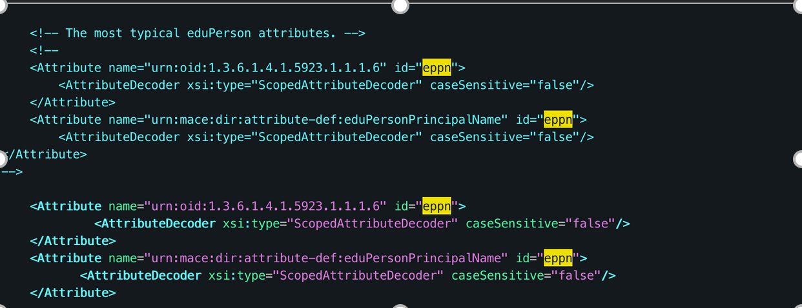
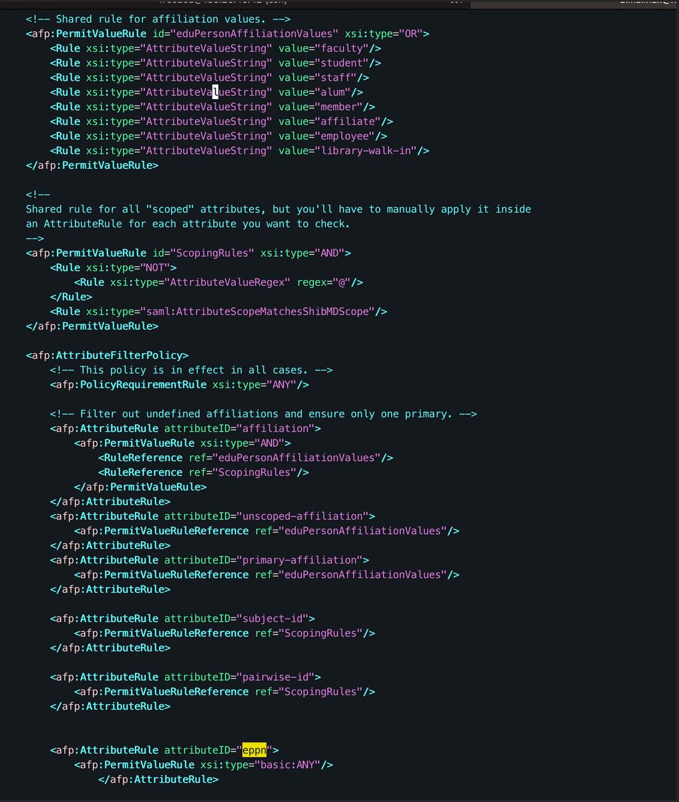
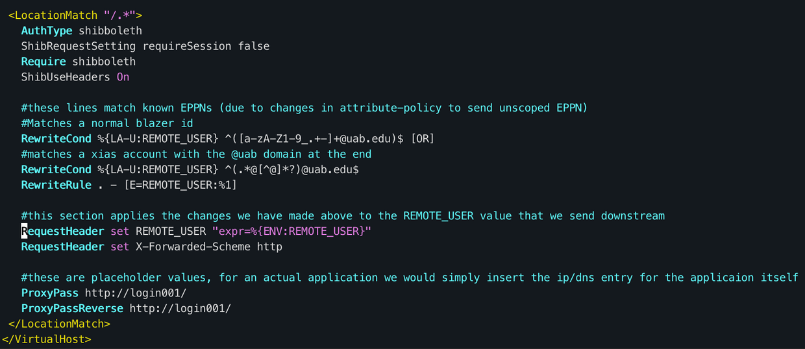

# Zero Trust Proxy Configurtion

The first change is in `/etc/shibboleth/shibboleth2.xml`

- Here in the `ApplicationDefaults` section we configure the policy that determines what our `REMOTE_USER` value will be as it flows through the proxy. The current set up is to check for eppn, then persistent-id, then finally targeted-id and then assign it to `REMOTE_USER`.

Our next change is in to `/etc/shibboleth/attribute-map.xml`

- In this file we can configure how the eppn value is decoded. In the current configuration we have left it as scoped but its possible to transform it into a simple string value as well

Here in `/etc/shibboleth/attribute-policy.xml` there are a few more change points

- First is the highlighted section showing the eppn. We currently have the `PermitValueRule` set to `basic:ANY` to allow the value to flow through simply as it is. Previously we were using the `PermitValueRuleReference ScopingRules` which can be seen towards the top of the screenshot, this policy defines what an acceptable value is for the rules that reference it.

In `/etc/httpd/conf.d/front-end.conf` we have a completely new entry

- From the top we set a wide-open location match that will allow the application behind the proxy to be able to easily check back in with the proxy for each request (applying a zero trust-esque flow). In the auth section below we set up this location to require shibboleth and currently let the application handle what to do with an unauthorized user.

- In the next block we preform one of two different regex matches depending on if a user has a BlazerID or if they are a XIAS user. Then we update REMOTE_USER and send it back down to the application
